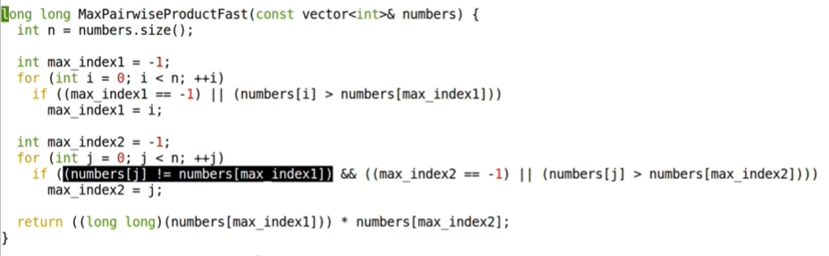

How to avoid the first check when index equals to -1?

Add the condition that when the index equals to -1, we can directly assign the index value to max index

Stress Test:

Ideal solution compared with an alternative solution (brute force) on the randomly generalized data sets -> using some rand library functions

In the meantime, the corner cases should be taken into consideration. For example, for the above function, if the vector only contains two same integer numbers. These corner cases are usually added manually, that is why they are called manual tests. Manual tests can be categorized as follows:
	1. max test
	2. min test
	3. integer overflow test(super big numbers)
	4. …

Combine the stress test and these manual tests -> solution is checked to be perfect :)

assert in Python

Take Away:

assert all (iterable) 
