Simple Programming Questions:

Linear Scan
At lease access each element in the input at least once

Complicated Programming Questions:

Naïve solutions are usually very time consuming
Algorithms usually can be optimized

Focus on algorithm problems:

Clearly Formulated
Hard to do efficiently

-> Problems to be discussed
Fibonacci Numbers
Greatest Common Divisor

How to describe a problem ? More mathematically or computationally?

At least:
Input format
Expected output

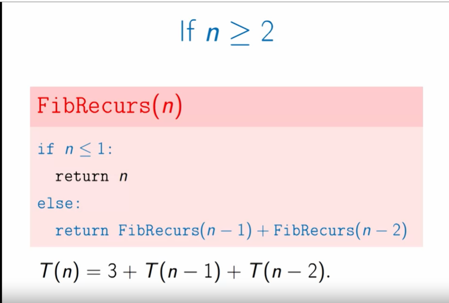

Means of analyzing the algorithm

Execution time -> start by checking the lines of codes to be executed

For all numbers larger than 1, there are three lines of codes (could be instructions ?) to be executed, this how 3 comes from, then each recursion will consume more line of codes.

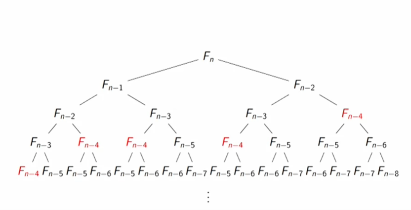

The naïve algorithm is not efficient. See the above tree, there are duplicated calculations for each number. For example, the number Fn-4 has been calculated for 4 times.
Assumption: Fn-k will be calculated for k times. In general, there are 1 + 2 + … + K-1 = k^2 duplicated calculations in total!

One more thinking: it seems that the induction in the above tree is top-to-bottom. This could be the main reason why there are lots of duplicated calculations. But if the calculation is done in bottom-to-up, then the require number in the calculation coming next is already ready.

Question: the relationship between bottom-to-up and up-to-bottom way?

A much more efficient solution:

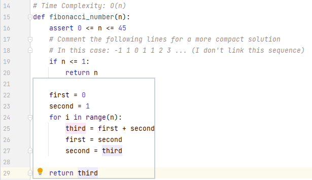

This solution is bottom-to-up, very similar to the process of induction :)

More thinking comes from Dynamic Programming (Fibonacci) (usfca.edu):

Fibonacci Table -> similar to the above solution, bottom-to-up with induction
Fibonacci Memorized -> still top-to-bottom, but with memorization of some numbers that have been calculated already!

Greatest Common Divisor

-> application in number theory, cryptography

algorithm efficiency on large number inputs

Euclidean Algorithms:

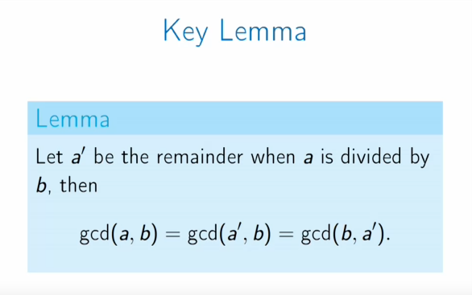

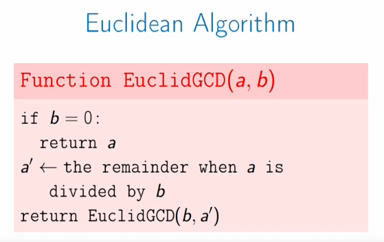

Note: even if a is smaller than b in the very beginning, the first iteration will do a swap between these two numbers.

Time complexity: log(ab)

Don't quite understand why saying each step reduces the size of numbers by about a factor of 2

Runtime Analysis

List or any container initialization -> depends on the management system
Increment, comparison and branch, addition of big integers(could taking non-trial time…), array loop-up

runtime depends on the computer performance / computer architecture / compiler / memory hierarchy…

It is not easy to figure out the accurate run time. (different computer / compiler …)

-> Solution
Measure the runtime without requiring too many details
Measure the runtime for large inputs

Asymptotic Notation:

Runtime complexity measurement always ignore the constant multiples.

Long scale behavior -> scaling with the increased input size

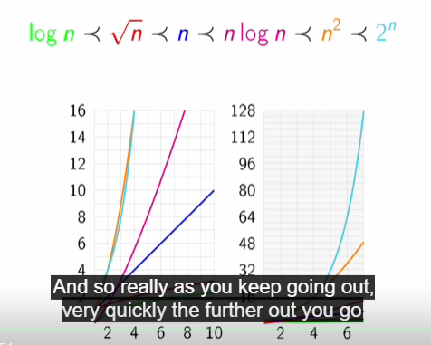

Big-O notation:

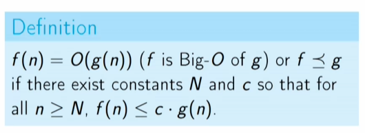

From the above theory, we can also see that the constant multiples does not matter as it can be scaled in any way…

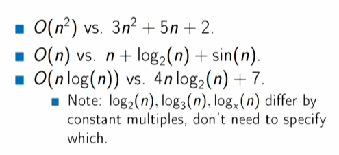

Using Big-O notation loses some important information about the constant multiples -> 100x faster is meaningless then

Big-O is defined based on the asymptotic

Sometimes the large input is not that practical, either the computer memory cannot afford such huge amount of data. Then the ``less better`` algorithm may be selected as it could be better than the optimal one in a smaller and affordable size of input.

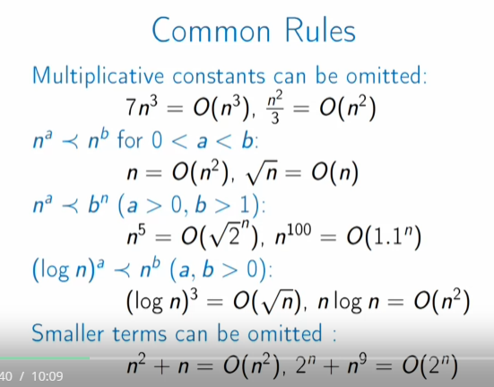

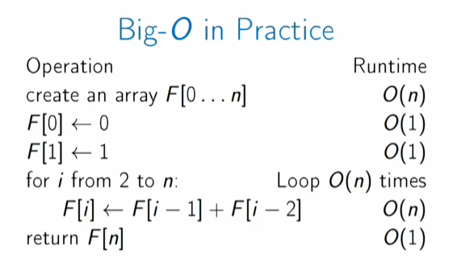

Regarding the line calculating the recursion ->
Here the concern is that the addition between two big integers is not that fast. Amount of work should be proportional to the number of digits -> number of digits is proportional to the number n. To my understanding, here it means that the addition consumption of time increases with the larger numbers, as we know array[n] is getting larger.

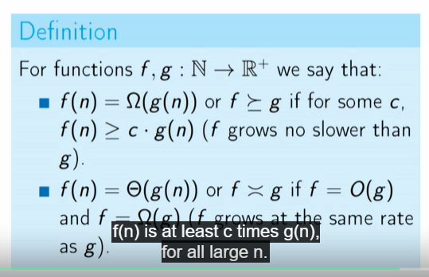

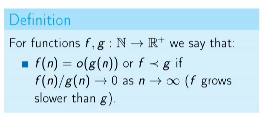

Take away from Lab:

two functions f and g:

* f grows slower than g: f(n)/g(n) -> 0 as n grows
* f grows no faster than g: f(n) <= c x g(n) -> Big O notation

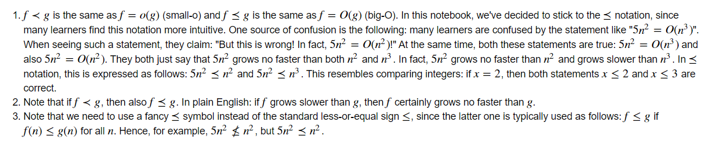

Regarding the last item:  <= means that the equation must be qualified in all valid range in which the function is defined.

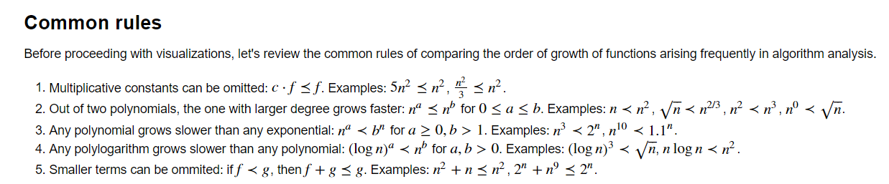

Regarding polylogarithm and polynomial:
proof given in the CLMS, substituting n and a in lim n^b/a^n = 0

The polylogarithm grows faster than polynomial even when n equals to 10**8!
Eventually it grows slower than polynomial when n equals significantly. When checking the relatively growing rate:

* it must first grows faster
* it must never grows slower back

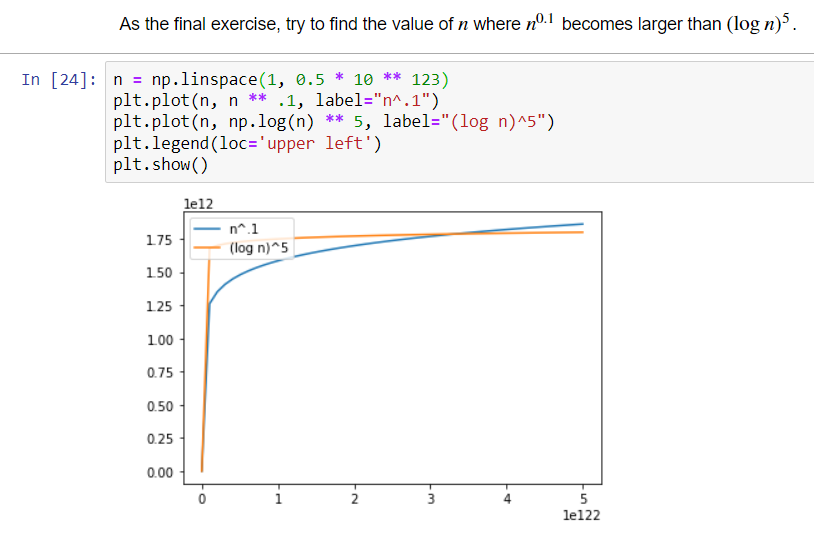

Amazingly! When n is larger than 10**125, n^0.1 starts growing faster than (logn)^5

Objects to be covered:

* Greedy Algorithms
* Divide and Conquer
* Dynamic Programming
